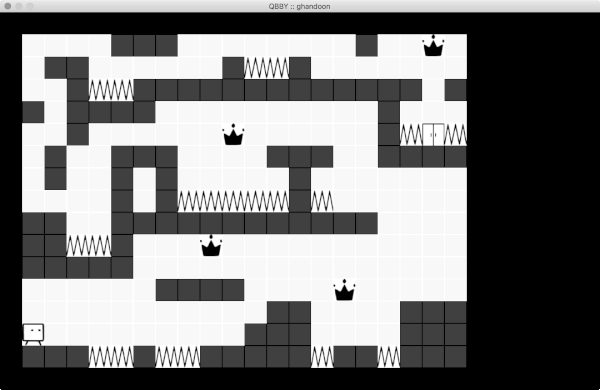

  
Qbby
===
a simple demo for early versions of [Nintendo's BoxBoy!](https://boxboy.nintendo.com)

## Gameplay

* Use arrow keys (:arrow\_down:, :arrow\_up:, :arrow\_right:, and :arrow\_left:) to move in four directions
* Use `E` and `Q` to jump to right and left
* Use `Ctrl` to toggle box-making mode
* In box-making mode, use `W`, `A`, `S`, and `D` to make new box in four directions
* Use `C` and `Z` to throw made boxes
* Use `Space` to move to another end of boxes
* Catch :crown: to get scores
* Avoid traps to stay alive!
* Reach the door to win the game



## Map

Maps should have a structure like:

    world_name
    sugar_cube_limit
    rewards_count
    start_point_left start_point_top
    end_point_left end_point_top
    width height
    bbbbbbbbbbbbbbbbbbbbb
    bwwwwbbwwbbwwwwxwwbbb
    bwswxwwwwwbwwwxewwbbb
    bbbbbbbbbbbbbbbbbbbbb

Top-left is <0, 0> of the coordination system.

Characters of the maps means:
* `w`: free space
* `s`: start point of level
* `e`: end point of level
* `x`: :crown:
* `b`: wall/block
* `t`: trap

Some example maps are provided in [world1.map](world1.map) and [ghandoon.map](ghandoon.map) files.

## Build & Run

### Build

You need a C++ compiler (e.g. `g++`) and SDL2 framework on you machine to build the program.  
Then you can build the program by:
```bash
make
```

#### C++ compiler

##### Linux Ubuntu
Run
```bash
sudo apt-get update
sudo apt-get install
```

##### OS X
Install Xcode, or install commandline tools:
```bash
command xcode-select --install
```
See [here](https://www.ics.uci.edu/~pattis/common/handouts/macclion/clang.html) for more details.

#### SDL2 Framework

##### Linux Ubuntu
Run:
```bash
sudo apt-get update
sudo apt-get install libsdl2-dev
```

##### OS X
Install HomeBrew if it is not installed:
```bash
/usr/bin/ruby -e "$(curl -fsSL https://raw.githubusercontent.com/Homebrew/install/master/install)"
```

Then install SDL2:
```bash
brew install sdl2
```

### Run

The game reads the map from terminal standard input on run. You can pipe a map file to it like:
```bash
./qbby.out < world1.map 
```
